# PES: Final Project
For the final project,I have created a program to get audio input and play it back via an external 12 bit DAC which communicated via I2C
  
This readme file contains the following information:
1. Project brief
2. Software tools used
3. Hardware components used
4. Software technologies implemented
5. Testing Methodology and Challenges faced
  
Additionally, a video of the project demo is available under the "doc" folder

## Project brief
This project aims to use the KY-037 microphone to record human voice and play it back using the MCP4725 DAC and a passive buzzer.   

I have also implemented a Musical note generator which generates the musical notes from A-G in the 4th Octave.

## Software components used
1. Laptop running Windows 11 
2. MCXpresso IDE
3. LogicPort Applcation for using logic analyser

## Hardware components used
1. MCP4725 – 12-bit I2C DAC
2. KY-037 - High sensitivity microphone sensor module
3. FRDM-kl25z development board
4. On-board RGB LED – To show audio record/playback status
5. Passive buzzer - To play audio using the MCP4725

## Software technologies implemented
1. DAC – To play audio using external transducers.
2. ADC – To capture audio from electret condenser microphone module.
3. I2C communication protocol - To communicate with the external 12 bit DAC
4. UART communication protocol - To communicate with the user and get inputs from them

## Testing Methodology and Challenges faced
Since this project involved the implementation and integration of several hardware components, my main focus was on gettign these hardware components to work and get to know their limits.  

1. MCP4725
Since the MCP4725 works on I2C protocol, I have to first initialize the onoboard I2C peripheral. Then I checked by sending the start and stop bits on the SCL and SDA lines.  
Once I was confident in sending these commands realiably, I next sent the data expected by the MCP4725 to set the DAC to the maximum value of 0xFFF using the FAST set command outlined in the datasheet. As-soon as i sent the data, I was able to get a voltage reading of 4.9V on the DAC output pin of the MCP4725 module. Cross-Checking this with the logic analyzer, I was able to confirm that the data was sent without any loss / corruption during transmission. 
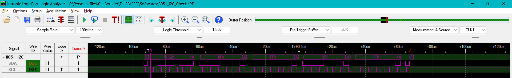
I was also able to find out that the MCP4725 board can only be updated only once every 0.5 milliseconds, which is ~2KHz.  

Hence, the maximum output sampling frequency achievable using this module is 2KHz 

2. KY-037, voice capture and playback
During testing, I came to the unfortunate reliazation that this sensor is sensitive enough to capture human voice, although it was capable of capturing any whistle sounds made by humans fairly accurately  

Another setback I had was realizing the KL25Z doesnot have the memory to store the voice sample data for 5 seconds at a frequency rate of 44.1KHz (required number of samples would be around 2,20,500). The maximum buffer I was able to achieve was only 6,615. So I was not able to achieve the initially targeted 5 seconds of playback. This coupled with the fact that the DAC module can only be updated a maximum of 1-2KHz would mean that faithfull reproduction of the captured audio would not be possible. 

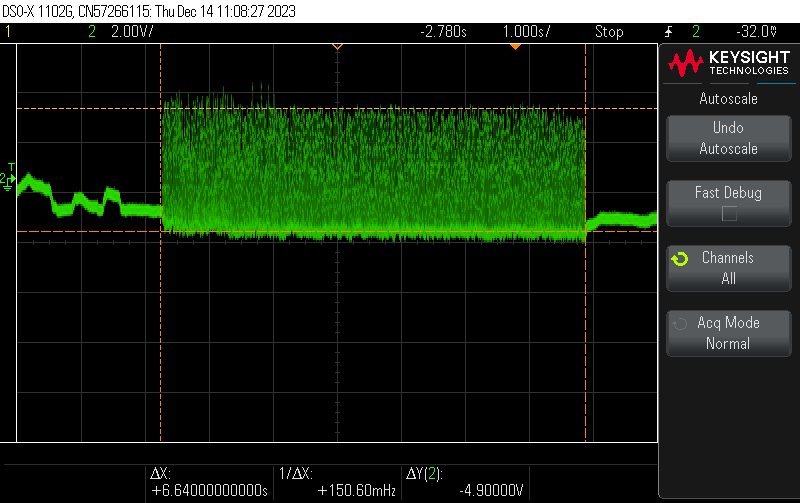
From this picture, we can infer that the voice playback duration is for 6.64 seconds, with a max amplitute of 4.9V 

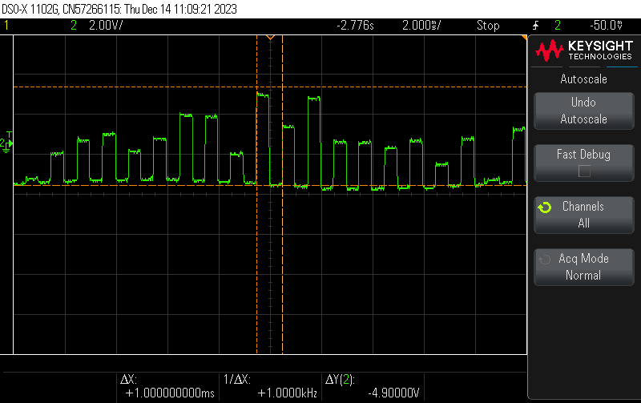
From this picture, we can see that the audio played back using the DAC is 1KHz in my implementation, although it is theoretically possible to get it till 2KHz

3. Tone Generation
To ensure that the MCP4725 module is working reliable and the fault is on the microphone module, I have also implemented a musical tone generator, that generates the musical notes from A-G in the 4th Octave. The frequency for these musical notes were taken from https://mixbutton.com/mixing-articles/music-note-to-frequency-chart/ 

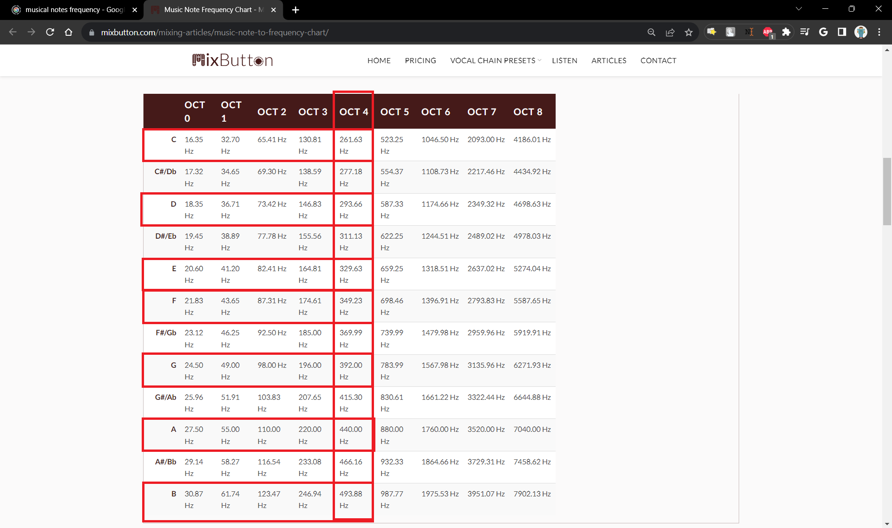
From the above link, I have set the following frequencies for the music notes as below
1. A -> 440.00 Hz
2. B -> 493.99 Hz
3. C -> 261.63 Hz
4. D -> 293.66 Hz
5. E -> 329.23 Hz
6. F -> 349.23 Hz
7. G -> 392.00 Hz
 
All these values were generated makking TPM2 module to generate a ISR at the required time intervals. by alternating the DAC value from min(0x000) to max(0xFFF) at the time intervals generated by the TPM2 module, I was able to create the desired musical tone for ~1 second. Below are the screenshots from the oscilloscope to verify that the tone are generated as exected, with a tolarance of +-1Hz  

Tone A:
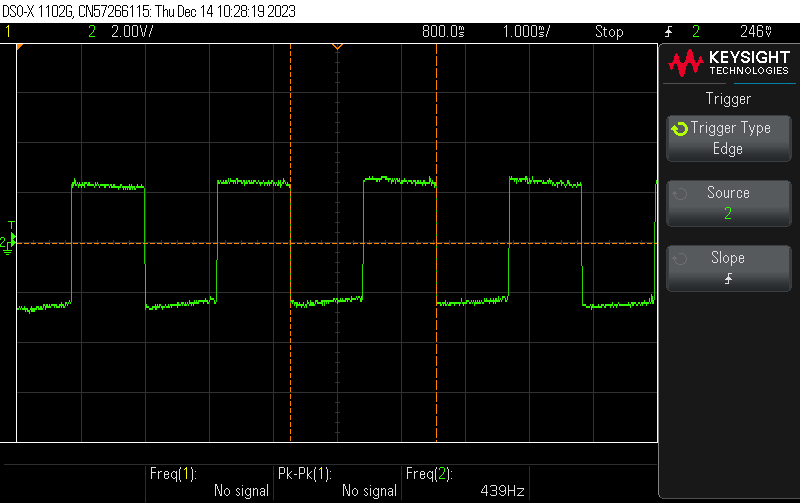 
Tone B:
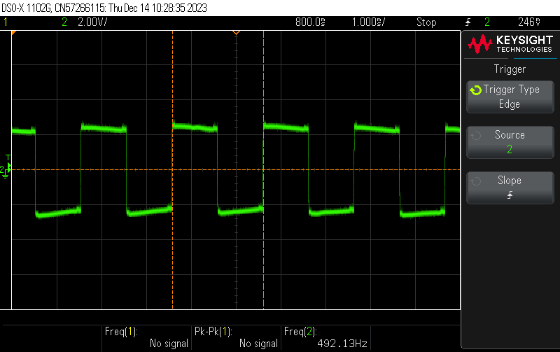 
Tone C:
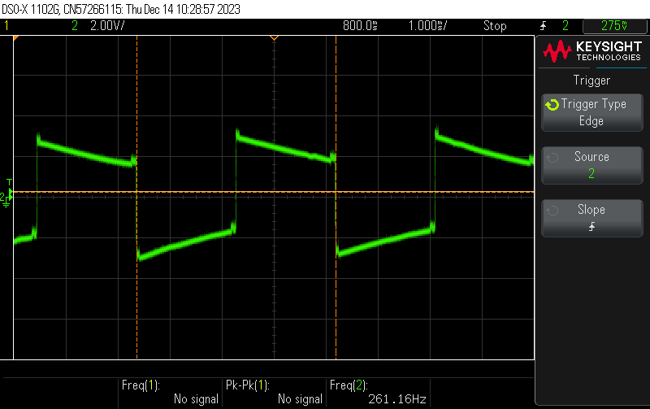 
Tone D:
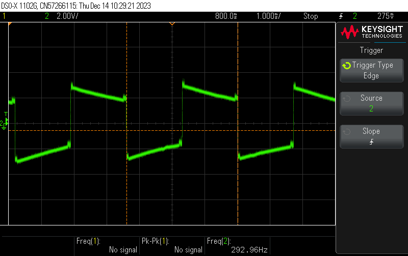 
Tone E:
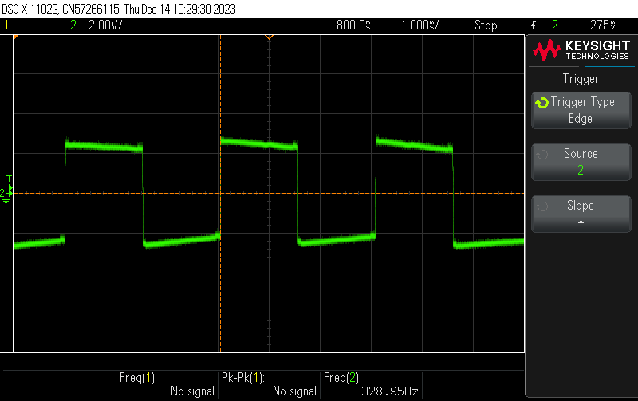 
Tone F:
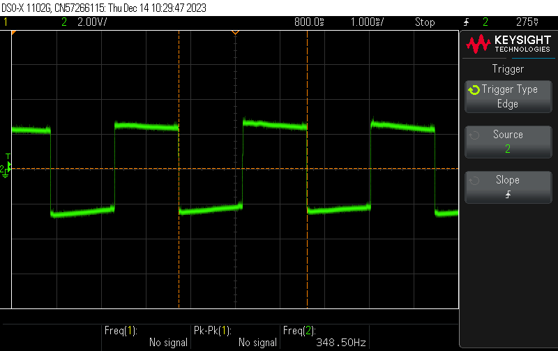 
Tone G:
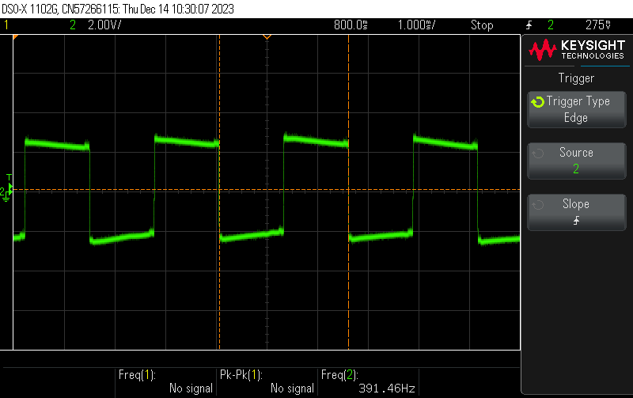  

I was also able to verify that the tone is generated for 1 second (not taking into account the time taken by the DAC to produce a stable 5V)  with a peak voltage of 5V
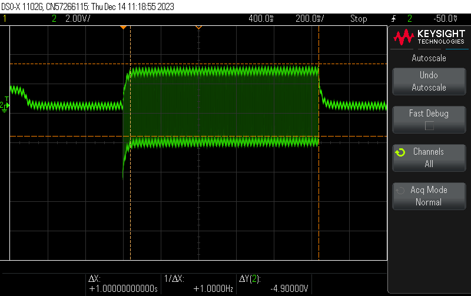
